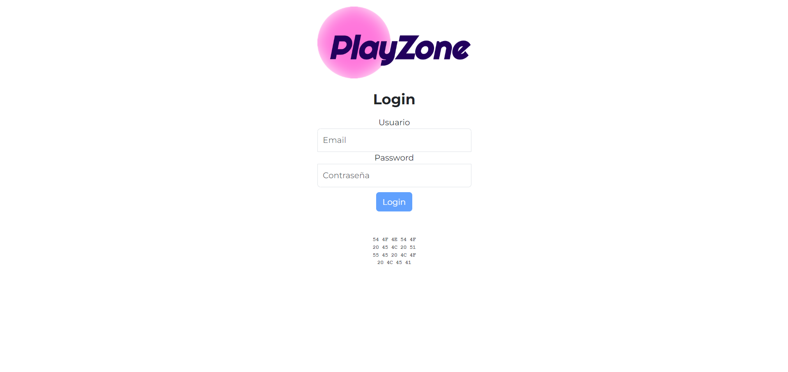
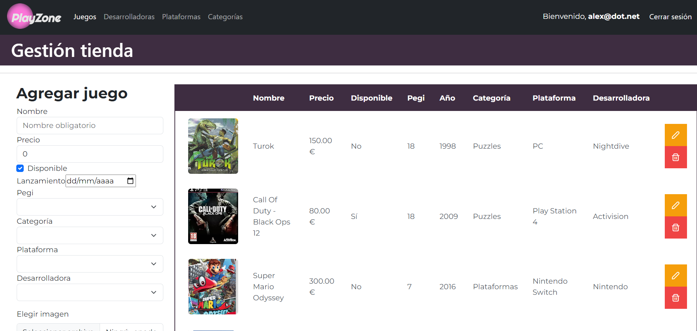

# Playzone: tienda de videojuegos

## Front End

Este repositorio incluye los archivos que componen el **frontend** para la aplicación web PlayZone, una web para gestionar nuestra tienda de videojuegos. Accede al repositorio del backend [aquí](https://github.com/alexBasurto/mi-tienda-videojuegos).

Esta aplicación ha sido desarrollada usando el framework Angular, como parte del proyecto final del Certificado de Profesionalidad de "Desarrollo de Aplicaciones web con Angular & .NET".

## Tecnologías

- Angular v16
- PrimeNG
- Bootstrap

## Puesta en marcha

Para la puesta en marcha de este proyecto, descargue el repositorio del backend desde [aquí](https://github.com/alexBasurto/mi-tienda-videojuegos). En ese repositorio están los estáticos del front incluídos y desde ahí se puede poner en marcha todo el proyecto. Este repositorio incluye el código fuente del front.

## Autores

En este proyecto hemos contribuido:

- [Eneko Galván](https://github.com/EnekoGS)
- [Gorka Ortega](https://github.com/motxobe)
- [Vero Cepeda](https://github.com/My-Vero)
- [Ibai Valente](https://github.com/ibaivalente)
- [Alex Basurto](https://github.com/alexBasurto)

## Capturas

Inicio de sesión:

Gestión de juegos:

